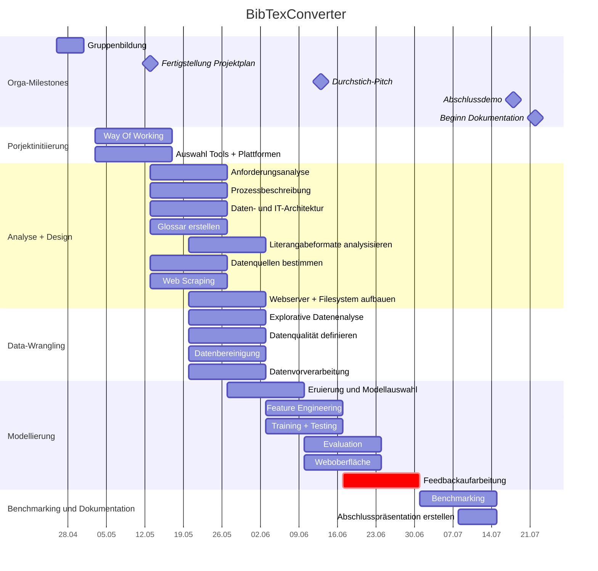

# BibTexConverter

---

## Kurzbeschreibung
Der BibTexConverter dient zur Übersetzung von Literaturverzeichnis-Einträgen in BibTex-Einträge, die in Folge für die Erstellung von Literaturverzeichnissen in eigenene Dokumenten verwendet werden können. Dem BibTexConverter können die zu konvertierenden Einträge über das Clipboard sowohl in Textform, als auch in Bildform (z.B. Ausschnitt aus einem Screenshot) als Eingabe zur Verfügung gestellt werden. 

---

## Lösungsbeschreibung
Der Konverter muss dabei die Informationen aus Literaturverzeichniseinträgen in einzelne Bestandteile zerlegen und den Attributen der BibTex-Struktur zuordnen können. Dazu sollte er möglichst viele der verwendeten Formate und Formatvarianten erkennen können. Im Fall von als Bildaten angegebenen Literaturverzeichnis-Komponenten ist die Erkennung des Textes in Images (OCR) zur Vorverarbeitung, um sie dann entsprechend weiter verarbeiten zu können. Der grobe Ablauf der Logik ist damit:

1. Texterkennung (OCR) - falls Bilddaten verwendet werden
2. Erkennung der Art des Eintrages (Buch, Artikel, Webseite, ...)
3. Extraktion der BibTex-Attribute aus dem Text des Literaturverzeichnis-Eintrags
4. Nachbereitung und Überführung des Ergebnisses in das BibTex-Format

Die Schritte (insbesondere Schritt 2-4) können dabei je nach gewählter Lösung zusammengefasst werden. Es ist auch denkbar, dass sich im Laufe des Projektes zeigt, dass es besser ist, die Schritte 2 und 3 zu vertauschen.

### Texterkennung (OCR)
Für die Texterkennung kann ggf. auf bestehende OCR-Frameworks, wie Tesseract zurückgegriffen werden.

### Erkennung der Art des Eintrages
Es handelt sich dabei um eine Klassifikationsaufgabe. Die Erkennung der Art des Eintrages ist erforderlich, da sie für die Erstellung des BibTex-Eintrages erforderlich ist. 

### Extraktion der BibTex-Attribute
Für die Extraktion der BibTex-Attribute sind mehrere Lösungsansätze denkbar, die abgewogen werden sollten.
* Extraktion mittels Prompt-Engineering über ChatGPT
* Extraktion mittels eines vortrainierten LLMs mit ggf. weiterer Verfeinerung durch Nachtraining
* Lösung, die Textpassagen klassifiziert (z.B. auf Token-Ebene), wobei die Klassen den Attributen des BibTex-Formates entsprechen

### Nachbereitung und Überführung des Ergebnisses in das BibTex-Format
Ggf. müssen die extrahierten Daten noch normiert bzw. nachbereitet werden und in das BibTex-Fromat überführt werden, wenn das verwendete Modell die erforderlichen Schritte nicht selbst abdeckt. Zu möglichen Normierungen bzw. Nachbereitungen zählen Beispielsweise die Vervollständigung von Konverenznamen und ggf. die Schreibweise bei mehreren Autoren (teilweise wird und, and oder & verwendet, um mehrere Autoren anzugeben). 

---

## Roadmap
| Datum  | Uhrzeit     | Termin                         |
|:-------|:------------|:-------------------------------|
| 17.04. |             | Kickoff (Call)                 |
| 25.04. |             | Themenauswahl & Gruppenbildung |
| 02.05. | 14:00-15:30 | Pitches (Call)                 |
| 13.05. |             | Projektplan angefertigt        |
| 17.05. |             | Feedback Projektplan           |
| 13.06. | 17:00-18:30 | Prototyp Pitches "Durchstich"  |
| 21.06. |             | Peer-Feedback                  |
| 18.07. | 8:00-10:00  | Abschlussdemo (Call)           |
| 30.09. |             | Abgabe Dokumentation           |

### Projektverlauf

### Projektphasen

#### Phase 1: Analyse

* Anforderungsanalyse:   Beschreibung
* Rohdaten (Text/Bild) aquirieren:   Beschreibung
* BibTex-Formate/Syntax:   Beschreibung  
* Ansatz-Recherche:   Beschreibung 
* Datenbereinigung:   Beschreibung

#### Phase 2: Implementierung        
* LLM-Screening:   Beschreibung 
* Tokenisierung:   Beschreibung 
* Prompt Engineering:   Beschreibung  
* Implememtierung:   Beschreibung 
* Testing:   Beschreibung

#### Phase 3 : Optimierung 
* Fehlerbehebung:   
  Beschreibung 
* Feedbackaufarbeitung:   Beschreibung
* Optimierung:   Beschreibung 
* Weboberfläche:   Beschreibung 

#### Phase 4 : Benchmarking und Dokumentation
* Benchmarking:   Beschreibung
* Texterkennung:   Beschreibung 
* Visualisierung:   Beschreibung 
* Abschlusspräsentation erstellen:   Beschreibung 

---

## Backlog Priorisierungen

### Prio1

### Prio2

* Texterkennung von Bildern

### Prio3
* Texterkennung von pdf
* Vervollständigung von Vornamen
* Abgleich mit Google-Scholar

---

## Verzeichnisstruktur
### dokumentation
Verzeichnis für die Beschreibung der Lösung und die Planung der Umsetzung etc.

### rohdaten
Rohdaten für das Training.

### (aufbereitete_daten / trainingsdaten / validierungsdaten)
Ggf. ergibt sich später, dass wir die Rohdaten doch noch vorbereiten müssen, oder wir splitten die die Daten fix in trainings- und testdaten, dann könnten wir ggf. noch diese Verzeichnisse anlegen. Aktuell 

### sourcen
Sourcen für die Umsetzung der Lösung.

### test
Sourcen für unittests (pytest).

### modelle
Ablageort für trainierte Modelle zur Wiederherstellung (pickle dumps etc).

---

## Quellen für Testdaten
https://aclanthology.org/
https://writemd.rz.tuhh.de/jkQeRnMWQ8a2sJFD4crhhg?both

---

## Sonstiges
Link zur Modulseite:
https://moodle.fernuni-hagen.de/course/index.php?categoryid=4
Direktlink:
https://moodle.fernuni-hagen.de/course/view.php?id=1461

Link zum Zoom Raum:
https://fernuni-hagen.zoom.us/j/68338461344?pwd=UTZJZXRsV29SYnVzSUt6aFV2WDBwQT09

